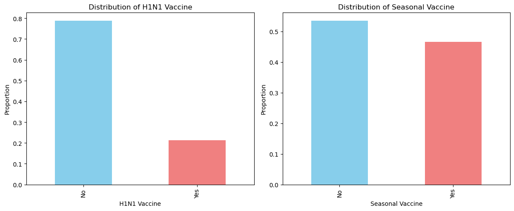
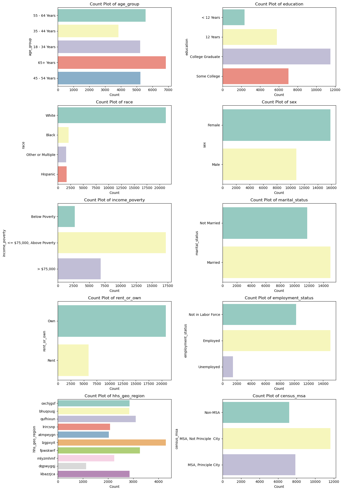
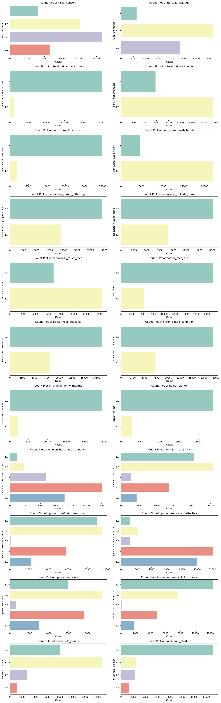
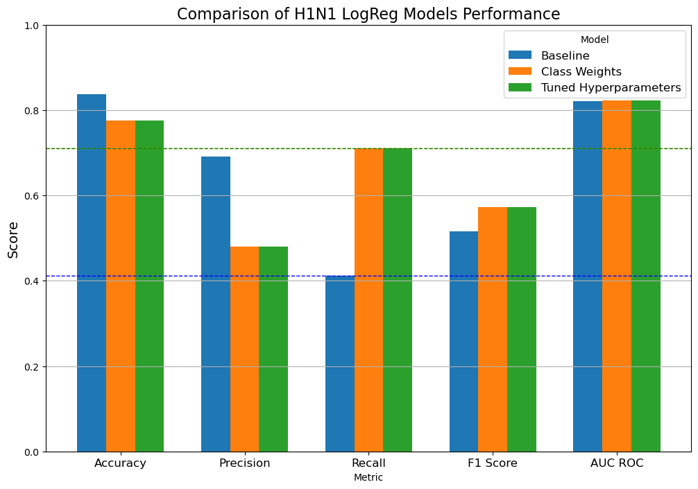
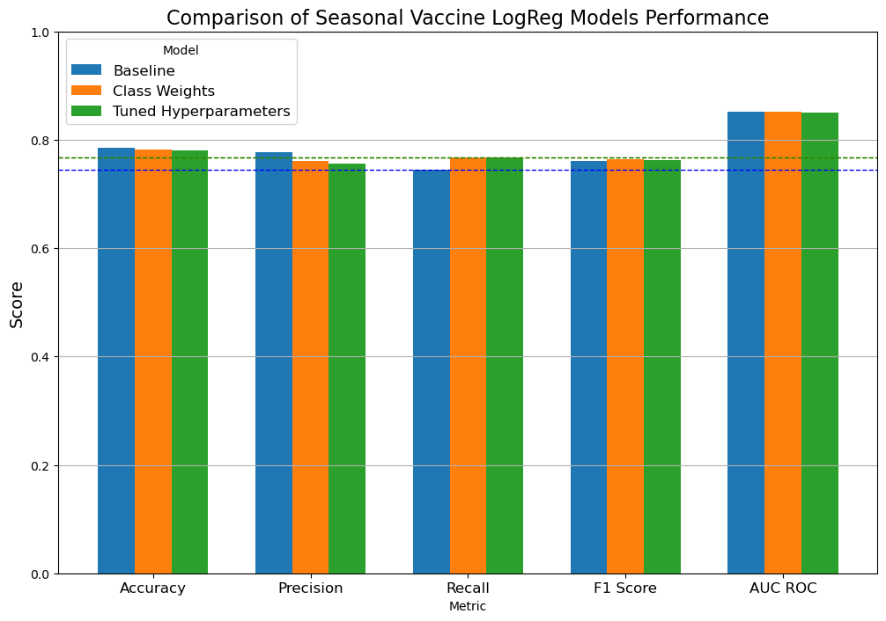
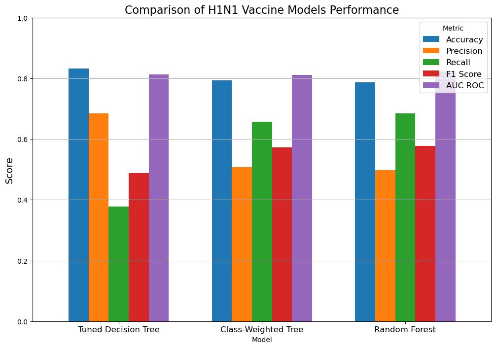
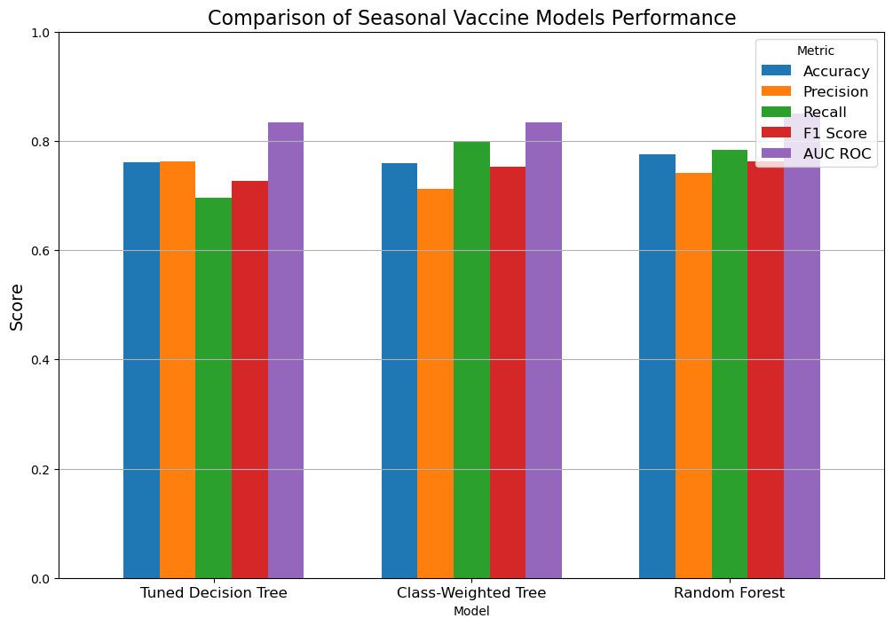

# Vaccine Visions: Cracking the Code of Vaccine Uptake with Data Science

## Introduction
In the face of global pandemics and seasonal flu outbreaks, understanding what drives individuals to get vaccinated is crucial for public health initiatives. Vaccination campaigns rely not only on the availability of vaccines but also on the willingness of the population to participate. However, vaccine hesitancy remains a significant barrier, influenced by a complex web of social, psychological, and demographic factors. This project, "Vaccine Visions: Cracking the Code on H1N1 and Flu Shots with Data Science," aims to dissect these factors and predict vaccine uptake using advanced machine learning techniques. By analyzing data from the National 2009 H1N1 Flu Survey, we explore the underlying patterns and predictors that can guide more effective vaccination strategies in the future.

## Problem Statement
Despite the availability of vaccines for the H1N1 virus and seasonal flu, a significant portion of the population remains unvaccinated. This poses a substantial challenge to public health, as unvaccinated individuals contribute to the spread of these viruses, leading to higher morbidity and mortality rates. The problem is multifaceted, involving factors such as socio-economic status, health beliefs, misinformation, and accessibility. The goal of this project is to develop predictive models that can accurately forecast whether individuals are likely to get vaccinated based on their demographic background, opinions, and behaviors. By identifying the key determinants of vaccine uptake, we can provide actionable insights to public health officials, helping to design targeted interventions that increase vaccination rates and protect communities from preventable diseases.

## Data Understanding
In this project, we aim to predict the likelihood of individuals receiving the H1N1 and seasonal flu vaccines based on a variety of demographic, behavioral, and attitudinal features. Understanding the data is a crucial step that sets the foundation for effective model building and analysis. Here, we will explore the dataset, its features, distributions, and relationships, providing insights that guide the subsequent steps in the project.

The dataset used in this project is derived from the National 2009 H1N1 Flu Survey. It includes responses from individuals regarding their vaccination status for both the H1N1 virus and the seasonal flu. Alongside these target variables, the dataset contains a wide range of features that capture respondents' demographics, health behaviors, and attitudes toward vaccination.

## Exploratory Data Analysis (EDA)
Rows (Observations): 26,707

Columns (Features + Targets): 38 (36 features + 2 target variables)

The dataset contains two key target variables:
1. h1n1_vaccine: Binary variable indicating whether the respondent received the H1N1 vaccine (1 = Yes, 0 = No).
2. seasonal_vaccine: Binary variable indicating whether the respondent received the seasonal flu vaccine (1 = Yes, 0 = No).

These variables are our primary focus, and we aim to predict them using the features provided.

### Feature Exploration
The features in the dataset can be broadly categorized into the following groups:
1. **Demographic Features:**

    `age_group`: Categorical feature indicating the age group of the respondent.

    `sex`: Categorical feature indicating the gender of the respondent.

    `education`: Categorical feature indicating the education level of the respondent.

    `income_poverty`: Categorical feature indicating the respondent's income relative to the poverty line.

    `race`: Categorical feature indicating the race of the respondent.

    `marital_status`: Categorical feature indicating the marital status of the respondent.

    `census_msa`: Categorical feature indicating whether the respondent lives in a metropolitan statistical area (MSA).

    `hhs_geo_region`: Categorical feature representing the respondent's geographic region.

2. **Health related Features:**

    `health_worker`: Binary feature indicating whether the respondent is a health worker.

    `health_insurance`: Binary feature indicating whether the respondent has health insurance.

    `chronic_med_condition`: Binary feature indicating whether the respondent has any chronic medical conditions.

    `child_under_6_months`: Binary feature indicating whether the respondent has close contact with a child under six months old.

    `household_adults`: Numerical feature indicating the number of adults in the respondent's household.

    `household_children`: Numerical feature indicating the number of children in the respondent's household.

    `doctor_recc_h1n1` and `doctor_recc_seasonal`: Binary features indicating whether a doctor recommended the H1N1 and seasonal vaccines, respectively.

3. **Attitudinal Features:**

    `h1n1_concern`: Ordinal feature indicating the level of concern about the H1N1 flu.

    `h1n1_knowledge`: Ordinal feature indicating the level of knowledge about the H1N1 flu.

    `opinion_h1n1_vacc_effective`: Ordinal feature representing the respondent's opinion on the effectiveness of the H1N1 vaccine.

    `opinion_h1n1_risk`: Ordinal feature representing the respondent's opinion on the risk of getting sick with H1N1 without the vaccine.

    `opinion_h1n1_sick_from_vacc`: Ordinal feature representing the respondent's concern about getting sick from the H1N1 vaccine.

    `opinion_seas_vacc_effective`: Ordinal feature representing the respondent's opinion on the effectiveness of the seasonal flu vaccine.

    `opinion_seas_risk`: Ordinal feature representing the respondent's opinion on the risk of getting sick with seasonal flu without the vaccine.

    `opinion_seas_sick_from_vacc`: Ordinal feature representing the respondent's concern about getting sick from the seasonal flu vaccine.

4. **Behavioral Features:**

    `behavioral_antiviral_meds`: Binary feature indicating whether the respondent has taken antiviral medications.

    `behavioral_face_mask`: Binary feature indicating whether the respondent has bought a face mask.

    `behavioral_wash_hands`: Binary feature indicating whether the respondent frequently washes hands or uses hand sanitizer.

    `behavioral_large_gatherings`: Binary feature indicating whether the respondent has reduced time at large gatherings.

    `behavioral_outside_home`: Binary feature indicating whether the respondent has reduced contact with people outside of their household.
    
    `behavioral_touch_face`: Binary feature indicating whether the respondent has avoided touching their face.

### Univarriate analysis
Here, we want to examine the distribution of individual features. 

But first, let's analyze the distribution of the target variables (`h1n1_vaccine` and `seasonal_vaccine`) to understand the prevalence of vaccination and assess class imbalance.

* For the H1N1 vaccine:

    * A larger proportion of respondents did not receive the H1N1 vaccine compared to those who did, indicating a potential class imbalance.
* For the seasonal vaccine:

    * The distribution is somewhat more balanced, with a higher proportion of respondents who received the seasonal vaccine compared to the H1N1 vaccine.

Next, we can have a look at the distribution of the individual features, starting with categorical features.

## Modeling

We started with a baseline logistic regression model, and improved upon it by adjusting for class imbalance by applying class weights and tuning hyperparameters and comparing the performance metrics.

### Performance metric selection
**The Case for Prioritizing Recall:**

Public Health Goals: In the context of public health, missing out on individuals who are likely to get vaccinated (false negatives) could mean failing to fully understand the factors driving vaccine uptake. This could lead to less effective strategies for increasing overall vaccination rates.

Comprehensive Coverage: Ensuring that we capture as many true positives as possible allows public health officials to cast a wider net in understanding and encouraging vaccination behaviors. This is crucial in times of public health crises, where maximizing vaccine uptake can be a matter of life and death.

**The Case for Prioritizing Precision:**

Resource Efficiency: If public health resources (like vaccine doses, outreach personnel, or communication campaigns) are limited, it might be more important to focus on those who are most likely to respond positively to vaccination campaigns. This approach ensures that resources are not wasted on individuals who are unlikely to get vaccinated.

Targeted Interventions: High precision could improve the effectiveness of targeted interventions, ensuring that efforts are concentrated on individuals who are both likely to get vaccinated and can be influenced by further encouragement.

**Conclusion: Prioritizing Recall**

For this project, recall should be prioritized over precision. The primary goal is to understand and predict vaccine uptake across the population, particularly to ensure that public health strategies are inclusive and comprehensive. By maximizing recall, we reduce the risk of missing individuals who are likely to get vaccinated, which is essential for understanding the broader factors driving vaccine uptake.

In a public health setting, especially during a pandemic or flu season, the cost of missing potential vaccine recipients (false negatives) can be higher than the cost of mistakenly predicting someone will get vaccinated when they won’t (false positives). By prioritizing recall, we ensure that we capture a wide range of vaccine recipients, providing valuable insights for boosting vaccination rates and protecting public health.

1. H1N1 Vaccine Model
    * Accuracy:
        * The accuracy remains at 77.57%, which is consistent with the model using class weights and slightly lower than the initial model. This indicates stable performance.
    
    * Precision:

        * Precision is 47.95%, which is lower than the initial model (69.00%) but consistent with the class-weighted model. This suggests a focus on improving recall, which often results in a drop in precision.
    * Recall:

        * Recall has significantly improved to 71.02%, the same as the class-weighted model. This is a substantial improvement over the initial model (41.26%) and indicates the model’s effectiveness in identifying true positives.
    * F1 Score:

        * The F1 Score is 57.24%, showing a balanced trade-off between precision and recall. This score is higher than the initial model (51.64%) and comparable to the class-weighted model.
    * AUC ROC:

        * The AUC ROC remains strong at 82.24%, comparable to the initial model (82.13%). This indicates the model’s continued ability to distinguish between vaccinated and non-vaccinated individuals effectively.
2. Seasonal Vaccine Model
    * Accuracy:

        * The accuracy is 78.05%, consistent with both the initial and class-weighted models, indicating robust performance.
    * Precision:

        * Precision is 75.67%, slightly lower than the initial model (77.66%) and comparable to the class-weighted model. This suggests the model maintains a good balance, even with the optimized parameters.
    * Recall:

        * Recall is 76.76%, an improvement from the initial model (74.34%) and consistent with the class-weighted model. This indicates that the model is effective in capturing true positives.
    * F1 Score:

        * The F1 Score is 76.21%, which is strong and slightly better than the initial model (75.96%). This indicates a balanced performance between precision and recall.
    * AUC ROC:

        * The AUC ROC remains strong at 85.05%, consistent with the initial and class-weighted models. This confirms the model’s ability to distinguish effectively between classes.

Best Performing Model: The model with tuned hyperparameters seems to be the best overall, especially if we consider the F1 score and recall as critical metrics. It balances precision and recall effectively while maintaining good performance in AUC ROC.

Class Weights Model: This model also performs well in recall, making it a good choice if the primary concern is capturing as many true positives as possible, albeit with a slightly lower F1 score compared to the tuned model.

Baseline Model: The baseline model is outperformed by the other two in recall and F1 score, making it less ideal in scenarios where recall is critical.

## Decision Trees
Next we build decision tree models, to pick if there are complex interactions between features.

We build a first baseline model, then tune hyperparameters and apply a random Forest Ensemble mothod.

## Choosing the Best Model
Given the performance metrics provided for different models predicting H1N1 and seasonal flu vaccine uptake, the choice of the best model depends on the specific priorities for this project. Since we have discussed prioritizing recall due to the public health implications, we should focus on models that perform well in terms of recall while still considering other metrics such as AUC ROC for overall model effectiveness.

### Conclusion
Best Model: **Random Forest**

For H1N1, the Random Forest model offers the best balance between recall and precision, with a solid F1 score and a strong AUC ROC. Given that recall is particularly important in public health contexts (e.g., capturing all true positives), the Random Forest model is the best choice for predicting H1N1 vaccine uptake.

The Random Forest model is the top performer for the Seasonal Flu vaccine as well, offering the best balance between precision, recall, F1 score, and AUC ROC.

## Evaluation of the Model's Predictive Power:
### H1N1 Vaccine Model Performance:
1. Accuracy: 78.76% - The model correctly predicts the vaccination status of individuals roughly 79% of the time.
2. Precision: 49.83% - Out of all the individuals the model predicted would get vaccinated, about 50% actually did. This reflects a moderate rate of false positives.
3. Recall: 68.54% - The model captures approximately 69% of all individuals who actually got vaccinated, which is crucial for public health purposes, as it indicates the model’s effectiveness in identifying those who chose to vaccinate.
4. F1 Score: 57.70% - This metric, which balances precision and recall, is relatively strong, indicating the model’s robustness in making balanced predictions.
5. AUC ROC: 82.32% - This score shows that the model is effective at distinguishing between vaccinated and non-vaccinated individuals, which is critical for understanding the factors driving vaccine uptake.

### Seasonal Vaccine Model Performance:
1. Accuracy: 77.56% - The model correctly predicts the vaccination status of individuals about 78% of the time, which is quite reliable.
2. Precision: 74.14% - Out of all the individuals the model predicted would get vaccinated, about 74% actually did, indicating a relatively low rate of false positives.
3. Recall: 78.34% - The model captures around 78% of all individuals who actually got vaccinated, reflecting its strong ability to identify those who chose to vaccinate.
4. F1 Score: 76.19% - This well-balanced metric demonstrates that the model effectively manages both precision and recall.
AUC ROC: 84.99% - This high score suggests that the model excels at distinguishing between vaccinated and non-vaccinated individuals, making it very effective for predictive purposes.

### How Well Does the Model Predict Its Target?
* **Strengths**:
    * Strong Recall: For both the H1N1 and Seasonal vaccine models, recall is notably high. This is crucial in a public health context where the primary goal is to identify as many individuals as possible who will or will not get vaccinated. High recall ensures that the model is not missing many individuals who actually got vaccinated.

    * Balanced Performance: The models show a strong balance between precision and recall, as evidenced by the F1 scores. This indicates that the models are reliable in making predictions that are both accurate and complete.

    * High AUC ROC: The AUC ROC scores for both models are above 82%, demonstrating that the models are very good at distinguishing between individuals who will and will not get vaccinated. This is a key measure of the model’s ability to correctly rank individuals by their likelihood of getting vaccinated.

* **Areas for Improvement**:
    * Moderate Precision: While the models perform well overall, the precision, particularly in the H1N1 model, is moderate. This means that there are still a number of false positives—individuals predicted to get vaccinated who do not. This could be a focus for further model refinement.

    * Further Tuning: Although the models are performing well, there might still be room for improvement through further hyperparameter tuning, particularly in the Random Forest's configuration, or by exploring more complex ensemble methods.

## Conclusion:
The Random Forest models we've developed are well-suited for predicting whether individuals will get vaccinated against H1N1 and the seasonal flu. They provide a good balance between identifying those who will get vaccinated (high recall) and ensuring that predictions are accurate (moderate to high precision and AUC ROC). These models are highly relevant for public health initiatives, as they can be used to target interventions more effectively and increase vaccination rates.

## Findings
This project aimed to predict vaccine uptake for both the H1N1 and seasonal flu vaccines using various machine learning models. The analysis provided several key insights into the factors influencing vaccination decisions and the effectiveness of the predictive models.

### H1N1 Vaccine Model:
Top 3 Features:

1. **doctor_recc_h1n1** is by far the most important feature, contributing more than half of the model's predictive power (53.03%). 
    This indicates that whether a doctor recommends the H1N1 vaccine is the strongest predictor of whether an individual will get vaccinated.
2. **opinion_h1n1_risk** and **opinion_h1n1_vacc_effective** are also significant, contributing 19.06% and 17.54%, respectively. This suggests that an individual's perception of the risk of H1N1 and the effectiveness of the vaccine are crucial factors.

Lesser Importance:
* Other factors like being a health worker (4.35%), concern about seasonal risks (1.45%), and vaccine effectiveness for seasonal flu (0.72%) have much lower importance but still contribute to the model.

### Seasonal Flu Vaccine Model:
Top 3 Features:
1. **opinion_seas_vacc_effective** is the most critical feature (34.32%), indicating that belief in the effectiveness of the seasonal flu vaccine is the strongest predictor of vaccination.
2. **doctor_recc_seasonal** also plays a significant role (22.80%), showing the importance of medical advice in vaccination decisions.
3. **opinion_seas_risk** (17.04%) highlights the role of perceived risk in the decision-making process for the seasonal flu vaccine.

Other Notable Features:

age_group (10.69%) is more important in the Seasonal model than in the H1N1 model, reflecting age's influence on seasonal vaccine uptake.

opinion_h1n1_vacc_effective (0.76%) has some influence, although much less than in the H1N1 model, indicating some crossover in vaccine perception.

# Recommendations from the Vaccine Prediction Project
1. **Focus on Healthcare Provider Recommendations**
    * Finding: The most important feature for predicting H1N1 vaccine uptake was whether a doctor recommended the vaccine, followed closely by personal opinions about the risk of H1N1 and the effectiveness of the vaccine. Similarly, for the Seasonal flu vaccine, the recommendation by healthcare providers was also highly influential.
    * Recommendation: 
        * Public health campaigns should prioritize involving healthcare providers in vaccination campaigns. Encouraging doctors, nurses, and other healthcare professionals to actively recommend vaccines to their patients could significantly boost vaccination rates. Training healthcare providers to effectively communicate the importance and benefits of vaccination could be a key strategy.
2. **Address Public Perceptions of Vaccine Effectiveness and Risk**
    * Finding: Opinions about the effectiveness and risk of the H1N1 and Seasonal flu vaccines were consistently among the top predictors of vaccination uptake.
    * Recommendation: 
        * Public health messaging should focus on reinforcing the effectiveness of vaccines and addressing concerns about risks. Educational campaigns could be tailored to dispel myths, provide transparent information about the benefits of vaccines, and reassure the public about safety. Using testimonials, infographics, and statistics that highlight the success of past vaccination efforts could help change perceptions.
3. **Leverage Data-Driven Targeting for Interventions**
    * Finding: The models developed in this project provide a strong predictive capability, allowing for the identification of individuals or groups with a higher or lower likelihood of getting vaccinated.
    * Recommendation: 
        * Utilize the predictive models to target interventions more effectively. For example, outreach efforts could be focused on individuals predicted to be hesitant about vaccination, providing them with additional information or personalized communication. Resources can be allocated more efficiently by focusing on areas or groups where the model predicts lower vaccination uptake.
4. **Monitor and Update Public Health Strategies**
    * Finding: The importance of features such as healthcare provider recommendations and public perceptions of vaccine risk and effectiveness suggests that these factors may change over time or in response to new information (e.g., new vaccine development, outbreaks).
    * Recommendation: 
        * Continuously monitor the factors that influence vaccine uptake and update public health strategies accordingly. Regularly collecting and analyzing new data can help adjust campaigns to address emerging concerns or changes in public perception, ensuring that strategies remain relevant and effective.

The insights gained from this project highlight the importance of targeted communication, leveraging healthcare provider influence, and addressing public perceptions to improve vaccination rates. 

By implementing these recommendations, public health authorities can enhance the effectiveness of vaccination campaigns, reduce vaccine hesitancy, and ultimately protect more individuals from preventable diseases.

# Limitations of this project.
1. **Data Quality and Representativeness:**
    * The dataset used in this project is derived from the National 2009 H1N1 Flu Survey. Although this dataset is comprehensive, it is based on self-reported data, which can introduce biases such as recall bias or social desirability bias. Participants might not accurately remember or might misreport their vaccination status, attitudes, or behaviors.
    * The extent to which the data accurately represents the broader population's attitudes and behaviors toward vaccination is uncertain. If certain demographic groups are underrepresented in the survey, the model may not generalize well to those populations.

2. **Temporal Relevance:**
    * The data is from 2009, related to the H1N1 pandemic and seasonal flu at that time. Public attitudes, healthcare practices, and vaccine technology have evolved since then. For instance, the context of vaccine hesitancy during COVID-19 or other more recent public health crises might be different.

3. **Model Generalizability:**
    * The models were trained and tested on the same dataset (using train-test splits). While cross-validation was used to mitigate overfitting, the true test of the model’s performance is its application to entirely new data from different populations or time periods.
    * The models might not generalize well to other populations or future data, particularly if those populations have different demographic or behavioral characteristics. The performance metrics might overestimate the model's effectiveness when applied outside the original dataset.
4. **External Factors Not Accounted For:**
    * The dataset may not account for all factors influencing vaccine uptake, such as accessibility to vaccination centers, media influence, or peer pressure, which are difficult to quantify and may vary over time and location.
    * The absence of these external factors in the model could limit the accuracy of the predictions, particularly in environments where these factors play a significant role.